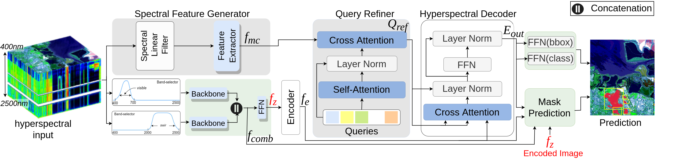

## MethaneMapper: Spectral Absorption aware Hyperspectral Transformer for Methane Detection

MethaneMapper is a fast and accurate deep learning based solution for methane detection from airborne hyperspectral imagery. MethaneMapper introduces a spectral absorption wavelength aware transformer network and largest public dataset called Methane HotSpot dataset (MHS). This repository contains code for MethaneMapper, scripts to download and online tool to visualize dataset.

### [**MethaneMapper: Spectral Absorption aware Hyperspectral Transformer for Methane Detection**](https://openaccess.thecvf.com/content/CVPR2023/papers/Kumar_MethaneMapper_Spectral_Absorption_Aware_Hyperspectral_Transformer_for_Methane_Detection_CVPR_2023_paper.pdf)
[Satish Kumar*](https://www.linkedin.com/in/satish-kumar-81912540/), [Ivan Arevalo](), [A S M Iftekhar](), [B S Manjunath](https://vision.ece.ucsb.edu/people/bs-manjunath).

Official repository of our [**CVPR 2023 (Highlights)**](https://openaccess.thecvf.com/content/CVPR2023/papers/Kumar_MethaneMapper_Spectral_Absorption_Aware_Hyperspectral_Transformer_for_Methane_Detection_CVPR_2023_paper.pdf) paper.





This repository includes:
* Source code of MethaneMapper.
* Pre-trained weights for methane plume bounding box detector and segmentation mask
* Scripts to download MHS dataset
* Online tool to visualize MHS dataset ([**BisQue**](https://bisque2.ece.ucsb.edu/client_service/view?resource=https://bisque2.ece.ucsb.edu/data_service/00-kKkPJUHK6KJDEVBRfDpmmA))
* Code for custom data preparation for training/testing
* Code for mapping ground truth masks from CarbonMapper to AVIRIS-NG flightline
* Annotation generator to read-convert mask annotation into json.


-brightgreen/?style=flat&logo=python&color=green)


The repository follows the structure of paper, making it easy to follow and use/extend the work. If this research is helpful to you, please consider citing our paper (bibtex below)

## Citing
If this research is helpful to you, please consider citing our paper:
```
@inproceedings{kumar2023methanemapper,
  title={Methanemapper: Spectral absorption aware hyperspectral transformer for methane detection},
  author={Kumar, Satish and Arevalo, Ivan and Iftekhar, ASM and Manjunath, BS},
  booktitle={Proceedings of the IEEE/CVF Conference on Computer Vision and Pattern Recognition},
  pages={17609--17618},
  year={2023}
}
```

## Usage

### Requirements
- Linux or macOS with Python >= 3.7
- Pytorch >= 1.7.0
- CUDA >= 10.0
- cudNN (compatible with CUDA)

### Installation
1. Clone the repository
2. Install dependencies
```
pip install -r requirements.txt
```

### Data Visualization
Please checkout to the [BisQue](https://github.com/UCSB-VRL/MethaneMapper-Spectral-Absorption-aware-Hyperspectral-Transformer-for-Methane-Detection/blob/main/data/visualize_data/README.md)

### Download Methane HotSpot (MHS) Dataset 
Please follow the tutorial [MHS_dataset](https://github.com/UCSB-VRL/MethaneMapper-Spectral-Absorption-aware-Hyperspectral-Transformer-for-Methane-Detection/tree/main/mhs_dataset) to download dataset

### Training

```bash
# PUT CODE HERE
```

### Evaluation

```bash
# PUT CODE HERE
```

## For developers
Pre-Commit
In order to provide some degree of uniformity in style, we can use the pre-commit tool to clean up source files prior to being committed. Pre-Commit runs a number of plugins defined in .pre-commit-config.yaml. These plugins enforce coding style guidelines.

Install pre-commit by following the instructions here: https://pre-commit.com/#install

Linux:
```
pip install pre-commit
```

Once pre-commit is installed, install the git hooks by typing:
```
# In git repo root dir
pre-commit install
```
Now, whenver you commit code, pre-commit will clean it up before it is committed. You can then add the cleaned-up code and commit it. This enforces coding standards and consistency across developers.

## License
MethaneMapper is released under the MIT license. Please see the [LICENSE](./LICENSE) file for more information.
