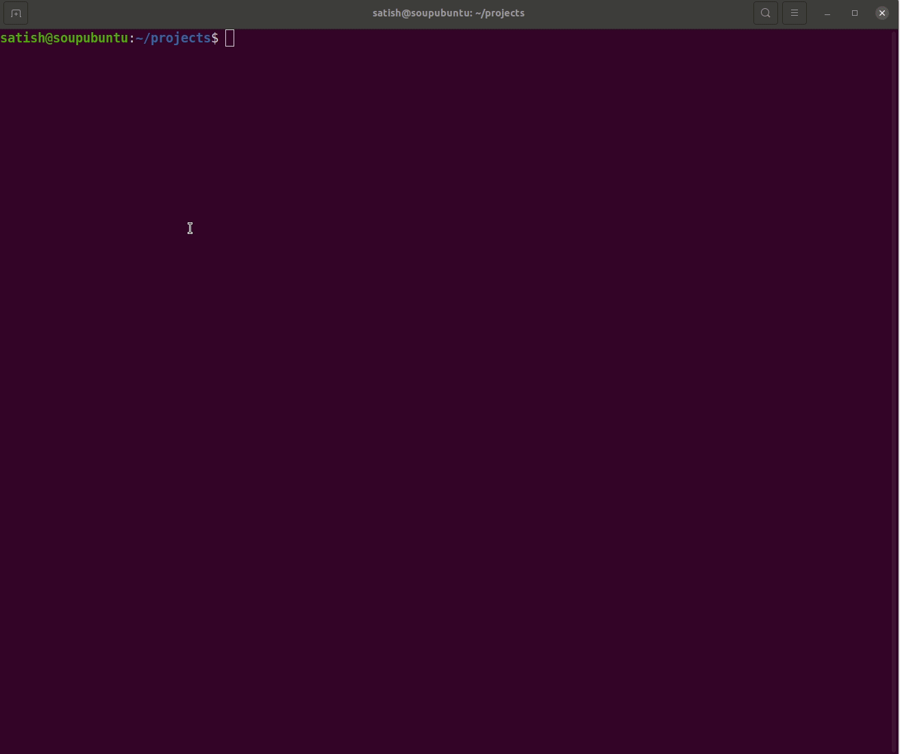

## Methane HotSpot Dataset
Methane HotSpot Dataset is a large-scale dataset of methane plume segmentation mask for over 1200 AVIRIS-NG flight lines from 2015-2022. It contains over 4000 methane plume sites. 

[Dataset size is over 10 Tera Bytes. We created a sftp server to download the data, please follow in steps:]()

### Video Tutorial for MHS data download


### Steps to download:
1. Open terminal on your linux machine or cmd windows system
2.  ```
    cd /location/where/to/download
    ```
3. Connect to SFTP server using the following command
    ```
    sftp -P 2022 anonymous@brain.ece.ucsb.edu
    ```
4. The data us available under "public" directory
    ```
    ls public
    ```
5. To download all data: Year 2015-2020 (over 10 TB size)
    ```
    get -r public/* .
    ```
6. To download a subset for trail: Year 2020 (~1 TB size)
    ```
    get -r public/training_data2020 .
    ```

This will create the following directory structure for:
```
./training_dataset2020 OR ./training_dataset16171819
|- mf_output
|- mf_output_norm
|- mf_tiles
|- mf_tiles_no_norm
|- rdata_tiles
|- rgb_tiles

```
